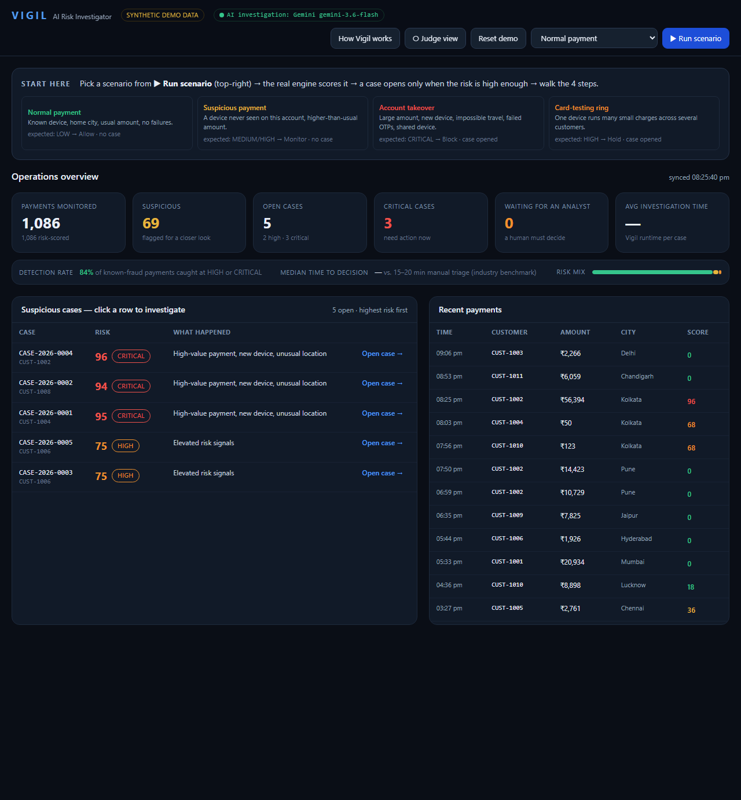
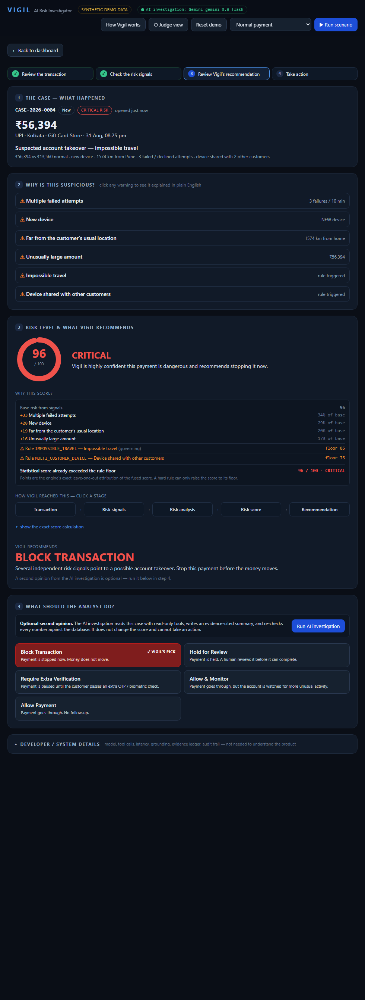
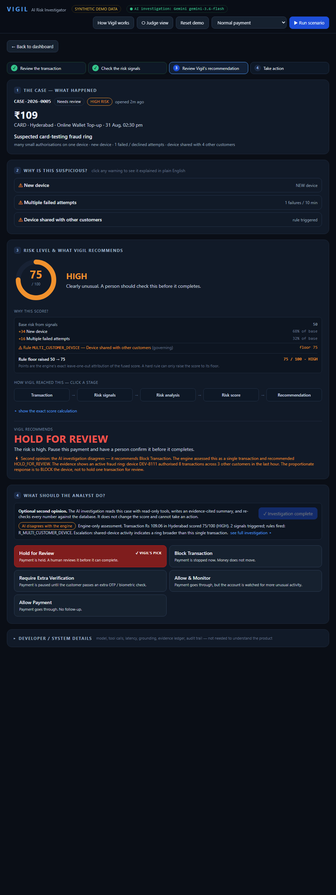
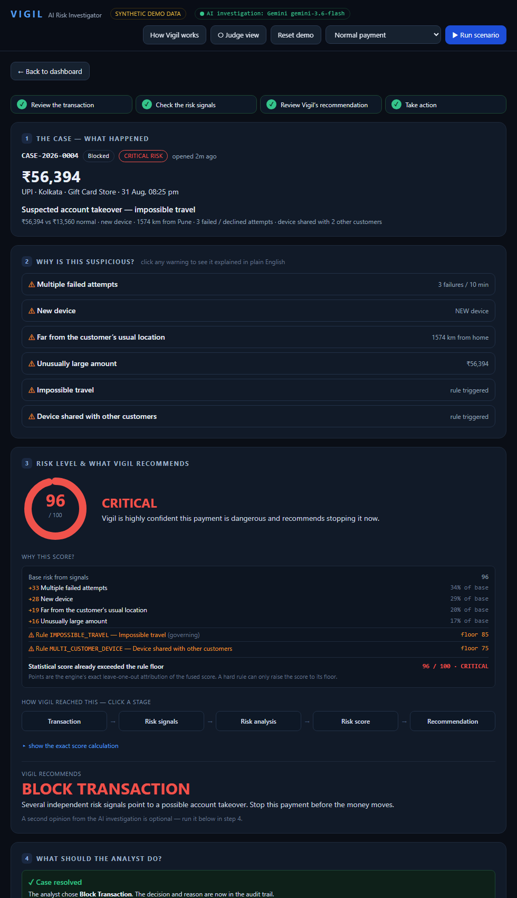

# Vigil — AI Risk Investigator

Razorpay AI Buildathon · **Track 2: AI Risk Manager**

[](https://vigil-pjuf.onrender.com)
&nbsp;
&nbsp;
&nbsp;

**🔗 Live demo: <https://vigil-pjuf.onrender.com>** — hosted on Render's free tier, so the
first request after it sleeps can take ~30–50s to wake. Then **How Vigil works → Run scenario**.

**Most systems give you a fraud _score_. Vigil gives you the _investigation_ behind it** —
the evidence, the reasoning, the recommended action — and leaves the final decision with a
human analyst.



It is built on three layers that never bleed into each other:

| Layer | Owns | Implementation |
|---|---|---|
| **Risk engine** — deterministic + statistical | the 0–100 **score**, band and recommended action | `backend/risk/` — 6 signal detectors, grouped **noisy-OR fusion** with **exact leave-one-out attribution**, deterministic **rule floors**, band→action policy |
| **AI investigation** — reasoning / synthesis | the **narrative + relationships**, as evidence-cited findings | `backend/agent/` — 5 **read-only** tools, evidence ledger, structured Pydantic output (no score field), **4-gate grounding validation** that recomputes every numeric claim against the database |
| **Human analyst** | the **decision** | approve / hold / block / override, a **mandatory reason** on any override, append-only audit trail |

The LLM never computes the score and never executes an action. Every quantitative claim it
makes is recomputed from the database before it is persisted (±1% tolerance); findings that
fail are shown with a `REFUTED` / `UNVERIFIED` badge, never silently dropped.

## Run it

```bash
python -m venv .venv
.venv/Scripts/activate                 # Windows;  source .venv/bin/activate on macOS/Linux
pip install -r requirements.txt
uvicorn backend.main:app --port 8000    # auto-seeds the synthetic DB on first start
```


### The AI investigation layer (optional)

The **risk engine is the reliable real-time path** — it is fully deterministic, synchronous,
and needs no API key. The AI investigation step is an *optional second opinion*:

* **No key configured → engine-only investigation.** A deterministic investigator builds the
  same evidence-cited `Investigation` from the engine's own signals. This is the **default,
  recommended path for a live demo** — instant and offline.
* **`GEMINI_API_KEY` set** (Google AI Studio free tier) → a live Gemini agent produces the
  investigation via its read-only tools. Slower (a multi-step tool loop), so not on the
  critical demo path.
* `ANTHROPIC_API_KEY` is also supported as an alternative provider. **No paid API is required.**

Provider precedence and the engine-only fallback are decided in one place: `backend/config.py`.

## Demo flow (2–3 min)

1. **Dashboard.** A normal night — ~97% of transactions score LOW. The one-line pitch and the
   `Transaction → Risk signals → Risk score → Explanation → Recommendation → Human decision`
   strip are on screen.
2. Click **Account takeover → Run scenario.** The engine synchronously scores it, opens a
   **CRITICAL** case, and jumps to the case.
3. **Risk signals — the evidence.** Six detectors; the ones that fired are shown as ranked
   bars with each signal's exact **% contribution** to the score, plus a plain-language list.
4. **Risk score 95 / 100 · CRITICAL**, with **Why Vigil flagged this**: the high-confidence
   indicators and a one-line synthesised conclusion (account takeover, not the real customer).
5. **Vigil recommends → BLOCK.** The score-calculation panel shows the rule floor visibly
   lifting the score (`R_IMPOSSIBLE_TRAVEL`, floor 85).
6. *(optional)* **Run AI investigation.** Findings appear each tagged `VERIFIED` against the
   database, with `✓ N / N numeric claims verified`. On the **Card-testing ring** case the
   investigator **dissents** — it recommends BLOCK the device, not hold one transaction.
7. **Analyst decision — [ Approve ] [ Hold ] [ Block ].** Choosing anything other than the
   recommendation requires a reason; the case status flips and the audit trail records that a
   **human** made the call.

**Reset demo** returns everything to the seeded state.

## The four scenarios

| Scenario | What it exercises | Score → band → action |
|---|---|---|
| **Normal payment** | engine *restraint* — known device, home city, usual amount | ~0 → LOW → **ALLOW**, no case |
| **Suspicious payment** | one real anomaly, no smoking gun (new device + higher amount) | ~36 → MEDIUM → **HOLD_FOR_REVIEW**, no case |
| **Account takeover** | new device + OTP failures + far-city high-value + impossible travel + shared device | ~95 → CRITICAL → **BLOCK**, case opened |
| **Card-testing ring** | one device runs many small charges across several customers; each txn is statistically mild, the **multi-customer-device rule** lifts it to HIGH | ~75 → HIGH → **HOLD_FOR_REVIEW**, case opened; AI dissents → BLOCK the device |

Severity and recommendation can never contradict each other — the band alone determines the
action (`backend/risk/policy.py`):
`LOW → ALLOW`, `MEDIUM → HOLD_FOR_REVIEW`, `HIGH → HOLD_FOR_REVIEW`, `CRITICAL → BLOCK`.

## Screenshots

**1 · The evidence, the score, the recommendation — one screen.**
An account-takeover case: every signal that fired with its exact % contribution, the rule
floor visibly lifting the score, and `BLOCK` as the recommendation — not the decision.



**2 · The AI is a second opinion that can disagree.**
On the card-testing ring the engine scores one mild transaction `HOLD`; the AI investigation
reads the shared-device activity and **dissents → BLOCK the device**. Every number it states
is re-checked against the database first.



**3 · A human makes the call, and the audit trail says so.**
The analyst chooses the action; an override needs a reason; the case status flips and the
append-only trail records that a person decided.



## Data

All data is **synthetic**, generated locally by `backend/seed.py` (deterministic, `SEED=42`).
No real Razorpay data, no real customer PII. `is_attack` / `scenario_label` are ground-truth
tags used only for the detection-rate metric — they are never shown to the risk engine or the
AI agent.

## Tech stack

FastAPI · SQLAlchemy + SQLite (WAL) · Pydantic · NumPy · Google GenAI / Anthropic SDK
(optional) · single-file frontend (Tailwind + Alpine via CDN, no build step).

## Layout

```
backend/
  main.py            FastAPI app (serves the API and the single-page UI)
  config.py          settings + provider selection; secrets from env only
  models.py          SQLAlchemy ORM (SQLite + WAL)
  risk/              signals · fusion (noisy-OR + leave-one-out) · rules · policy · engine
  agent/             tools (read-only) · schema · prompts · runner · validator · fallback
  api/               transactions · cases · investigations · decisions · dashboard · admin
  seed.py            deterministic synthetic population + scripted scenarios
  static/index.html  the whole frontend
tests/test_smoke.py  end-to-end: ingest → case → investigate → grounding → dissent → decision → audit
```

## Why Vigil is different

A fraud score is a number an analyst still has to justify. Vigil hands them the justification:
which signals fired and by how much, how a deterministic rule moved the number, a grounded
narrative that cannot invent figures, a recommendation, and a decision step that keeps a human
accountable. Engine, AI and human are separate by construction — you can see exactly which one
did what.
